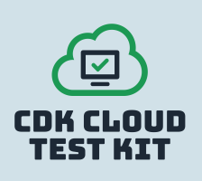

# CDK Cloud Test Kit

The CDK Cloud Test Kit is a set of TypeScript classes, with the aim of making it straightforward to test [CDK constructs](https://TODO) in the cloud.

The approach is based on two key classes:

- `IntegrationTestStack` - A base [`Stack`](https://TODO), used to deploy the construct under test along with any test drivers and test observers.
- `IntegrationTestClient` - A class that is used to drive the construct under test and to poll for the resulting test observations.

TODO: Diagram

The best way to see what the `cdk-cloud-test-kit` can do for you is to look at the examples or, better still, run them.

## Examples

### [Simple Event Router](https://github.com/andybalham/cdk-cloud-test-kit/blob/main/examples/simple-event-router)

This example tests a construct that encapsulates a simple SNS event router. It demonstrates how the toolkit can publish test events and observe the effects to validate the behaviour.

### [Simple Message Router](https://github.com/andybalham/cdk-cloud-test-kit/blob/main/examples/simple-message-router)

This example is similar to the Simple Event Router, but uses SQS queues with DLQs instead of SNS topics. It demonstrates how the toolkit can be used to test error conditions with the use of mock Lambda function responses.

### [Loan Processor State Machine](https://github.com/andybalham/cdk-cloud-test-kit/blob/main/examples/loan-processor-state-machine)

This example demonstrates how the toolkit can be used to test step functions. It shows how the toolkit can be used to execute and monitor step functions and how it can be used to exercise all the step function branches with the use of mock responses. In addition, it demonstrates how the toolkit can be used to observe DynamoDB table events along with SQS queues and SNS topics.

### [Notification Hub](https://github.com/andybalham/cdk-cloud-test-kit/blob/main/examples/notification-hub)

This example shows how the toolkit can be used to put events on an EventBridge event bus. It also shows how the toolkit can be used to test event patterns, both prior to deployment and also once the rules are deployed.
